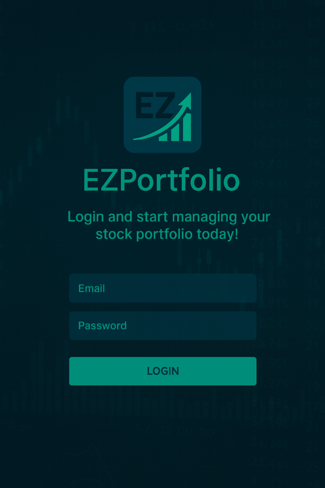

# Ez Portfolio stocks 📈

**Ez Portfolio stocks** is a modern, beautiful, and intuitive stock portfolio management application built with React. It allows users to track their stock investments, monitor live prices, manage transactions, and analyze portfolio performance with a premium "glassmorphism" user interface.



## ✨ Features

-   **Real-Time Market Data**: Fetches live stock prices using Yahoo Finance integration.
-   **Portfolio Management**:
    -   Track total portfolio value, day change, and overall gain/loss.
    -   Manage holdings with Buy and Sell transactions.
    -   **FIFO (First-In-First-Out)** logic for accurate profit calculation on sales.
-   **Dividend Tracking**: Monitor dividend yields and payouts.
-   **Smart Suggestions**: Get live stock suggestions with "Trending" and "Top Gainer" indicators.
-   **Stock Details**: View detailed metrics like Market Cap, PE Ratio, and 52-week High/Low.
-   **Modern UI/UX**:
    -   Responsive design with a sleek Glassmorphism aesthetic.
    -   Interactive charts and visual indicators.
    -   Dark/Light mode optimized components.

## 🛠️ Tech Stack

-   **Frontend**: [React](https://reactjs.org/) (Vite)
-   **Styling**: [Tailwind CSS](https://tailwindcss.com/)
-   **Icons**: [Lucide React](https://lucide.dev/)
-   **Routing**: React Router DOM
-   **Data Fetching**: Yahoo Finance API (via CORS proxy)

## 🚀 Getting Started

Follow these steps to set up the project locally.

### Prerequisites

-   Node.js (v14 or higher)
-   npm or yarn

### Installation

1.  **Clone the repository**
    ```bash
    git clone https://github.com/jozhray/Ez_Portfolio.git
    cd Ez_Portfolio
    ```

2.  **Install dependencies**
    ```bash
    npm install
    ```

3.  **Start the development server**
    ```bash
    npm run dev
    ```

4.  **Open the app**
    Visit `http://localhost:5173` in your browser.

## 📁 Project Structure

```
Ez_Portfolio/
├── src/
│   ├── assets/         # Images and static assets
│   ├── components/     # Reusable UI components
│   ├── context/        # React Context (Auth, etc.)
│   ├── data/           # Static data and mock files
│   ├── pages/          # Main application pages (Portfolio, Suggestions, Login)
│   ├── services/       # API services (priceService, storage)
│   └── App.jsx         # Main application entry point
├── index.html
├── package.json
├── tailwind.config.js
└── vite.config.js
```

## 🤝 Contributing

Contributions are welcome! Please feel free to submit a Pull Request.

## 📄 License

This project is open source and available under the [MIT License](LICENSE).
